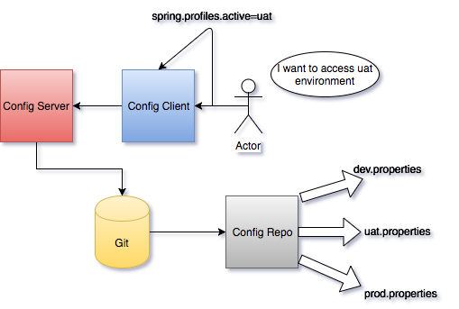

# springboot-cloud-config-demo
This project shows how to use spring boot cloud config for changing the environment in real time

### Config Server ###

* Created config server project and mapped the git repo for load the property file
* Configuration property file must be bootstrap.yml or bootstrap.properties.

`
server:
  port: 9501
management:
  security:
    enabled: false
spring:
  cloud:
    config:
      server:
        git:
          uri: https://github.com/techragesh/springboot-cloud-config-demo
          search-paths: cloudconfigrepo
  application:
    name: cloudconfigserver
`
* Enable @EnableConfigServer in the Sprinboot Application Class.
* No need to restart the configserver application if you want to change the enviornment file from cloudconfigclient.

### Config Client ###

* Configuration property file must be bootstrap.yml or bootstrap.properties.
`
server:
  port: 9502
spring:
  cloud:
    config:
      uri: http://localhost:9501
  application:
    name: cloudconfigclient
  profiles:
    active: production
management:
  security:
    enabled: false
`
* Use @RefreshScope for refresh the configuration if you want to change the enviornment file so that no need to restart the cloudconfigserver.

### Config repo ###

* Created cloudconfigrepo folder in the git.
* Created property file based on different enviornment.
* Property file name should be <clientprojectapplicationname>-<envname>.property file.
  For example this project client application name is cloudconfigclient so the created property file was cloudconfigclient-production.properites
  
  # Happy Coding #
